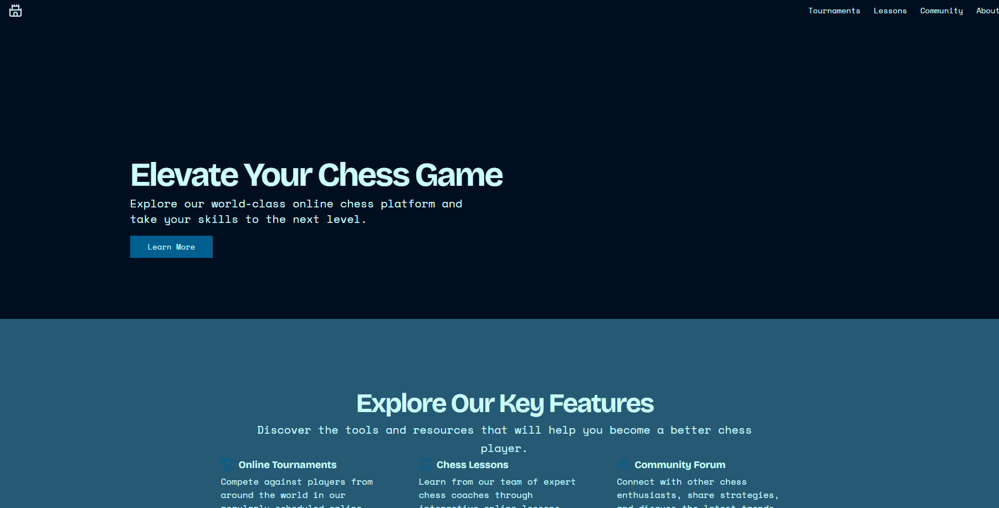

# Chess Game with WebSocket



## Overview

This project implements a real-time chess game where users can connect and play against each other online. It uses WebSocket for real-time communication and is built with Node.js, NestJS, and WebSocket.js.

## Features

- **Real-time Chess Game**: Play chess against other users in real time.
- **WebSocket Communication**: Utilize WebSocket for bidirectional communication.
- **User Connections**: Connect with online users and join games.

## Technologies

- **Backend**: NestJS
- **Frontend**: JavaScript with WebSocket.js
- **WebSocket**: For real-time communication

## Prerequisites

- Node.js (v14 or higher)
- npm or yarn

## Installation

### Backend

1. Clone the repository:
   ```bash
   git clone https://github.com/your-username/chess-game.git
   cd chess-game/backend
   ```

2. Install dependencies:
   ```bash
   npm install
   # or
   yarn install
   ```

3. Start the NestJS server:
   ```bash
   npm run start
   # or
   yarn start
   ```

### Frontend

1. Navigate to the frontend directory:
   ```bash
   cd ../frontend
   ```

2. Install dependencies:
   ```bash
   npm install
   # or
   yarn install
   ```

3. Start the frontend application:
   ```bash
   npm start
   # or
   yarn start
   ```

## WebSocket Configuration

The WebSocket server is set up in the NestJS backend. Make sure to configure the WebSocket URL in the frontend to match the server's address.

## Usage

1. **Connect to the Server**: Open the frontend application in your browser.
2. **Create or Join a Game**: Use the provided interface to create a new game or join an existing one.
3. **Play Chess**: Use the interactive chess board to make moves and play against other users in real time.

## Contributing

1. Fork the repository.
2. Create a new branch (`git checkout -b feature/your-feature`).
3. Make your changes and commit them (`git commit -am 'Add new feature'`).
4. Push to the branch (`git push origin feature/your-feature`).
5. Create a new Pull Request.

## License

This project is licensed under the MIT License.
